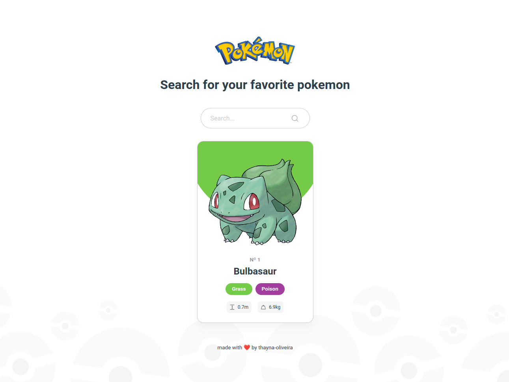

<div align="center">


## Pokémon Finder

Pokémon Finder is an online pokédex made with Angular & PokéAPI where you can find information about your favorite pokémon!

Click here <strong><a href="https://app-pokemon-finder.netlify.app/" target="_blank">to view demo</a></strong>

</div>

---

### ✨ Screenshots

|  |  |
| :-------------------------------------: | :------------------------------------: |

### 📥 Getting Started

1. Start by cloning the repo

```bash
$ git clone https://github.com/thayna-oliveira/pokemon-finder.git && cd pokemon-finder
```

2. Install NPM packages

```bash
$ npm install
```

3. Run the local development server

```bash
$ npm run start
```

Now you are ready to find your pokémon! 🎉 You just need to navigate to `http://localhost:4200/` and play with the app.

<br />

### 👩‍💻 Built with

- [Angular v 15.2.9](https://github.com/angular/angular-cli)
- [PokéAPI](https://pokeapi.co/)
- [TypeScript](https://www.typescriptlang.org/)
- [Jest](https://jestjs.io/)

<br />

### 🧡 Credits

Thanks to PokéAPI for sharing free data and images to build this app.
